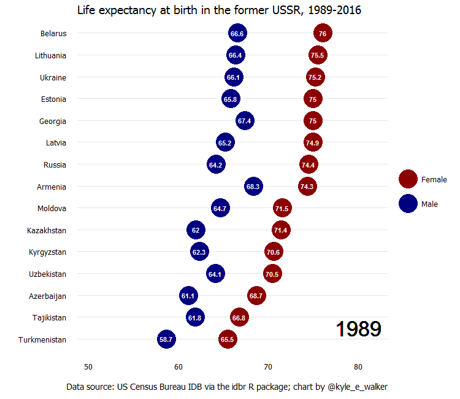

[__Mapping Immigrant America__](http://personal.tcu.edu/kylewalker/immigrant-america/)

_Mapping Immigrant America_ is an interactive dot map of the US immigrant population, designed in Mapbox Studio.

Media coverage of this project: 

* [A Colorful Dot Map of America's Immigrants (_CityLab_)](http://www.citylab.com/work/2015/09/a-colorful-dot-map-of-americas-immigrants/403849/)
* [This colorful map illustrates where Boston's immigrants live (boston.com)](https://www.boston.com/news/local-news/2015/09/09/this-colorful-map-illustrates-where-bostons-immigrants-live)
* [Immigrant America (FlowingData)](http://flowingdata.com/2015/09/03/immigrant-america/)
* [The Week In Data: Immigrants, Executions, And Apple-Induced Heartbeats (FiveThirtyEight)](http://fivethirtyeight.com/datalab/the-week-in-data-immigrants-executions-apple-heartbeats/)
* [Interactive maps pinpoint Boston's immigrant enclaves (_New Boston Post_)](http://newbostonpost.com/2015/10/14/interactive-maps-pinpoint-bostons-immigrant-enclaves/)
* [This map reveals the hidden geography of immigration in Louisville and across the United States (Broken Sidewalk)](http://brokensidewalk.com/2015/immigration-map/)

---

[__Locating neighborhood diversity in the American metropolis__](https://walkerke.shinyapps.io/neighborhood_diversity/)

Interactive Shiny application to share some of the results of my research on diversity in US metropolitan areas.  

Media coverage of this project: 

* [Where Are the Most Diverse Neighborhoods? (_CityLab_)](http://www.citylab.com/housing/2016/05/a-new-visual-tool-explores-the-changing-geography-of-diversity-in-us-metros-app/481218/)
* [UT report: Rising costs, school woes push blacks to leave Austin (_Austin American-Statesman_)](http://www.mystatesman.com/news/news/local/ut-report-rising-costs-school-woes-push-blacks-to-/nrQ8t/)

---

[__tigris (R package)__](https://github.com/walkerke/tigris)

  

<iframe src="http://walkerke.shinyapps.io/tigris-zip-income" width = "100%" height = "500" scrolling="no" frameborder="0"></iframe>

tigris is an R package that allows users direct access to US Census Bureau geographic datasets with minimal code, and includes some functionality to help users work with these datasets in their R projects.

Examples of tigris in action: 

* [Manipulating and mapping US Census data in R using the acs, tigris and leaflet packages - Zev Ross](http://zevross.com/blog/2015/10/14/manipulating-and-mapping-us-census-data-in-r-using-the-acs-tigris-and-leaflet-packages-3/)
* [The Season for Sharing Data: Working with the newly released Census 2010-2014 ACS 5 year data in R - UC Berkeley D-Lab](http://dlab.berkeley.edu/blog/season-sharing-data-working-newly-released-census-2010-2014-acs-5-year-data-r)

---

[__idbr (R package)__](https://github.com/walkerke/idbr)

  

idbr is an R package that gives R users access to the US Census Bureau's International Database API, which includes data on both historical and future projections of international demographic indicators.  

Examples of idbr in action: 

* [Japan's ageing population, animated with R - David Smith/Revolutions Blog](http://blog.revolutionanalytics.com/2016/02/japans-ageing-population-animated-with-r.html)
* [Number of retired people expected to rise sharply - Duc-Quang Nguyen/swissinfo.ch](http://www.swissinfo.ch/eng/demography_number-of-retired-people-expected-to-rise-sharply/42150668)

